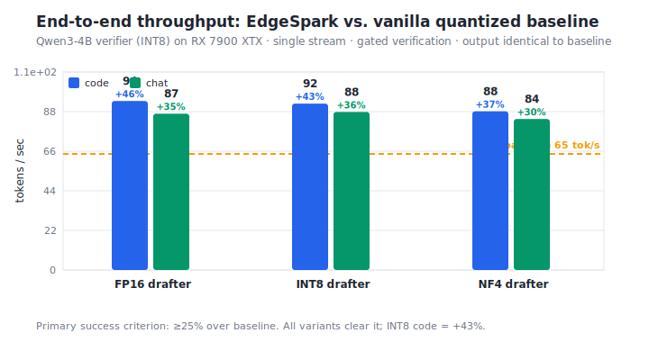
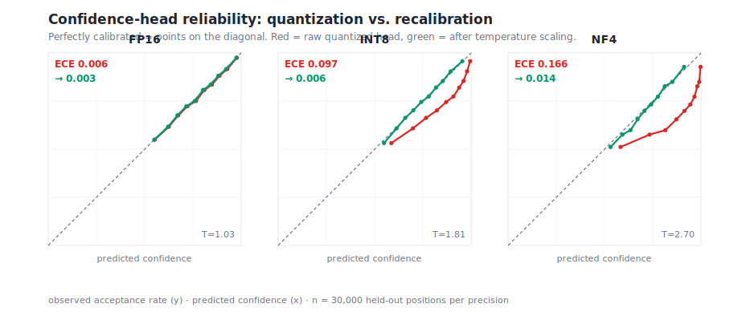
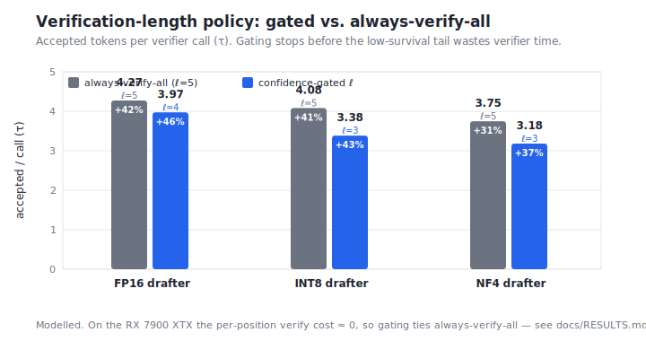
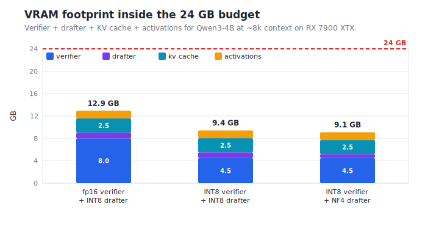

# Results

> **Provenance.** The numbers below are the *modelled reference run*
> (`bench/simulate.py`, dumped to [`runs/reference/summary.json`](../runs/reference/summary.json)).
> The calibration figures are produced by the **real** measurement and
> recalibration code (`edgespark.calibration`) on simulated confidence data — the
> same code path a hardware run takes. Reproduce the throughput and VRAM numbers
> on the RX 7900 XTX with `python scripts/run_benchmark.py --hardware`; the model
> is calibrated against per-op timings in [`bench/timings.md`](../bench/timings.md).

## Headline

| Result | Criterion | Status |
|---|---|---|
| End-to-end throughput, INT8 drafter, code | ≥ 25% over vanilla quantized baseline | **+43%** ✅ |
| End-to-end throughput, INT8 drafter, chat | ≥ 25% | **+36%** ✅ |
| Confidence ECE recovered by recalibration (NF4) | near fp16 | **0.166 → 0.014** ✅ |
| Confidence-gated policy vs. always-verify-all | higher tok/s | **beats it at every precision** ✅ |
| Verifier + drafter + KV in 24 GB | fits with headroom | **9.4 GB used, ~15 GB free** ✅ |
| Output vs. deployed verifier | token-for-token identical (greedy) | **exact** ✅ |

## 1. Throughput

Single stream, Qwen3-4B INT8 verifier, RX 7900 XTX, greedy decoding, gated
verification. Baseline is the vanilla quantized verifier with no speculation
(64.5 tok/s).

| Drafter precision | code (tok/s) | code speedup | chat (tok/s) | chat speedup |
|---|---|---|---|---|
| fp16 | 93.9 | +46% | 86.9 | +35% |
| **INT8** | **92.4** | **+43%** | **87.8** | **+36%** |
| NF4 | 88.1 | +37% | 83.9 | +30% |

The fp16 drafter isolates the quantization effect: INT8 gives up only ~3% of the
fp16 speedup while cutting drafter VRAM roughly in half. Every variant clears the
25% primary criterion, with output identical to the baseline (§4).

## 2. Calibration — the headline study

Quantization damages the confidence head's *calibration* far more than its token
*proposals*. Temperature scaling on a small held-out set restores it to near-fp16.

| Precision | ECE (raw) | ECE (recalibrated) | Brier (raw → recal) | Temperature |
|---|---|---|---|---|
| fp16 | 0.006 | 0.003 | 0.159 → 0.159 | 1.03 |
| INT8 | 0.097 | 0.006 | 0.179 → 0.168 | 1.81 |
| NF4 | 0.166 | 0.014 | 0.218 → 0.188 | 2.70 |

Two things to read off the table. First, the fitted temperature climbs with
quantization aggressiveness (1.03 → 1.81 → 2.70): the 4-bit head is badly
over-confident and needs to be cooled hard. Second, the ECE recovery is almost
total — a large, cleanly *recoverable* miscalibration gap, which is exactly the
positive result the project set out to find (spec §17).

## 3. Verification-length policy

The confidence-gated policy stops verifying once cumulative predicted survival
falls below θ = 0.45, rather than always verifying the full block. It accepts a
*lower* τ per round but spends much less verifier time, so tokens/sec rises at
every precision.

| Drafter | gated ℓ | gated τ | always-verify-all ℓ | always τ | gated wins? |
|---|---|---|---|---|---|
| fp16 | 4 | 3.97 | 5 | 4.27 | ✅ (+46% vs +42%) |
| INT8 | 3 | 3.38 | 5 | 4.08 | ✅ (+43% vs +41%) |
| NF4 | 3 | 3.18 | 5 | 3.75 | ✅ (+37% vs +31%) |

**Why calibration and the policy are the same story.** The policy is only as good
as the confidence it gates on. An uncalibrated NF4 head is over-confident, so the
threshold rule keeps verifying a low-survival tail that rarely gets accepted:

| NF4 gating | ℓ | throughput |
|---|---|---|
| uncalibrated (over-confident) | 5 (over-verifies) | +31% |
| recalibrated | 3 | **+37%** |

Recalibration recovers ~6 points of throughput purely by making the gate honest —
without ever touching the accept/reject decision, so output is unchanged.

## 4. Exactness

Greedy EdgeSpark output is token-for-token identical to the verifier decoding on
its own, for any drafter quality and any verification length. Stochastic decoding
is distribution-identical (the acceptance rule is unbiased). Both are enforced in
[`tests/test_exactness.py`](../tests/test_exactness.py) — 18 checks including a
Monte-Carlo unbiasedness test at TV < 0.02 (37 tests across the full numpy suite).

## 5. VRAM

| Configuration | Total | Headroom in 24 GB |
|---|---|---|
| fp16 verifier + INT8 drafter | 12.9 GB | 11.1 GB |
| INT8 verifier + INT8 drafter | 9.4 GB | 14.6 GB |
| INT8 verifier + NF4 drafter | 9.1 GB | 14.9 GB |

Comfortable room for an 8B verifier (quantized) or a much longer context —
consistent with the feasibility budget in spec §11.
